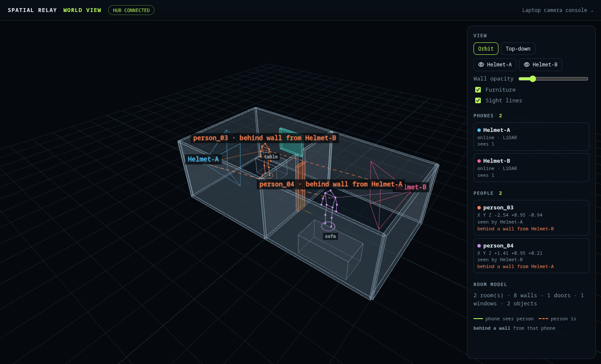
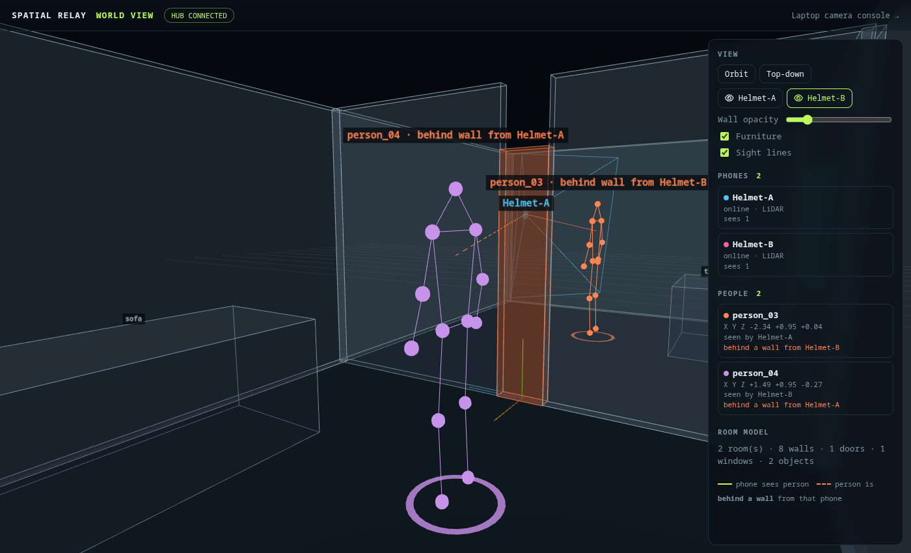

# Spatial Relay

Processing hub and demonstrator for **deep-learning-based real-time multi-camera human localization and AR-assisted situational awareness**. The system synchronizes multiple observer viewpoints into a single unified 3D room coordinate system: an iPhone observer supplies camera feed, real-time pose, and 3D human body skeleton detections; a Python hub transforms and tracks targets in a shared coordinate frame; and a laptop AR console visualizes augmented human overlays and a 2D floor map.

---

## Architecture Overview

```
 ┌───────────────────────────┐                 ┌───────────────────────────┐
 │   iPhone Mobile Observer  │                 │    Laptop AR Console      │
 │   (Swift · ARKit · LiDAR) │                 │      (Web / Browser)      │
 │                           │                 │                           │
 │ • ARKit 6-DoF Tracking    │                 │ • Webcam Pinhole Viewport │
 │ • Apple Vision Body Pose  │                 │ • Frustum Gating Overlays │
 │ • LiDAR Per-Joint Depth   │                 │ • Real-time 2D Floor Map  │
 │ • Multi-Person Detection  │                 │ • Interactive Calibration │
 └─────────────┬─────────────┘                 └─────────────▲─────────────┘
               │                                             │
               │  WebSocket: /ws/observer                    │  WebSocket: /ws/viewer
               ▼                                             │
      ┌──────────────────────────────────────────────────────┴─────────────┐
      │                         Python Relay Hub                           │
      │                     (FastAPI + Uvicorn + NumPy)                    │
      │                                                                    │
      │ • Shared coordinate frame calibration (T_world_from_phone)         │
      │ • Multi-person tracking with stable person_NN ids                  │
      │ • 25 Hz continuous pose broadcasting and viewer synchronization    │
      └────────────────────────────────────────────────────────────────────┘
```

---

## Modules

| Module | Description | Implementation |
|---|---|---|
| **M1 Acquisition Contract** | Timestamped pose, 3D metric joints and detection packets | `src/spatial_relay/models.py`, `clients/ios/.../Protocol.swift` |
| **M2 Deep Pose Estimation** | On-device human body pose (Apple Vision, multi-person) | `clients/ios/.../ObserverController.swift` |
| **M3 3D Metric Localization** | LiDAR depth sampling + pinhole back-projection per joint | `ObserverController.swift`, `src/spatial_relay/localization.py` |
| **M4 Shared Frame Calibration**| Rigid coordinate transforms mapping phone and laptop into world $W$ | `src/spatial_relay/calibration.py`, `RoomFrame.swift` |
| **M4b Multi-Person Tracking** | Stable `person_NN` ids across frames (nearest-neighbour + 1-euro smoothing) | `src/spatial_relay/tracking.py` |
| **M5 Real-Time Relay** | FastAPI WebSocket server broadcasting at 25 FPS | `src/spatial_relay/server.py` |
| **M6 AR Projection** | Laptop camera frustum gating, skeleton projection and floor map | `web/viewer.js`, `web/index.html` |
| **M8 Room Model & Shared Map** | RoomPlan multi-room scan + ARWorldMap relocalization | `RoomScanner.swift`, `src/spatial_relay/room.py` |
| **M9 Multi-Phone Fusion** | Cross-camera person fusion + 15 Hz world packet | `src/spatial_relay/world.py` |
| **M10 3D World View** | three.js god view, helmet views, through-wall sight lines | `web/world.html`, `web/world.js` |
| **M7 Visual-Inertial Odometry** | ARKit world tracking, gravity aligned | `ObserverController.swift` |

---

## Quickstart Guide

### 1. Start the Python Hub

```bash
# From the repository root:
python3 -m venv .venv
source .venv/bin/activate  # On Windows: .venv\Scripts\activate
pip install -r requirements.txt
pip install -e .

# Run the hub server on your LAN:
PYTHONPATH=src python3 -m uvicorn spatial_relay.server:app --host 0.0.0.0 --port 8000 --reload
```

The hub is now active on port `8000`. You can verify health at `http://localhost:8000/health`.

---

### 2. Install the iPhone Observer App

The observer is a native Swift app (ARKit + LiDAR + Apple Vision), built and installed **from Linux with a free Apple ID** using [xtool](https://github.com/xtool-org/xtool). One-time setup (Swift toolchain, Xcode.xip SDK, `xtool auth`) is in [`clients/ios/SpatialRelayObserver/README.md`](clients/ios/SpatialRelayObserver/README.md).

```bash
cd clients/ios/SpatialRelayObserver
. ~/.local/share/swiftly/env.sh
xtool dev        # builds, signs and installs over USB
```

* Requires a LiDAR iPhone (12 Pro or later Pro models) for person detection, iOS 17+.
* Free Apple ID installs expire after 7 days — re-run `xtool dev` to refresh.
* In the app, tap ⚙ and enter the laptop's IP (`ip -4 addr`) and port `8000`. Allow **Camera** and **Local Network**.
* The header shows a green `HUB` when connected; the laptop console shows `PHONE LIVE`. If not, open `http://<laptop-ip>:8000/health` in iPhone Safari to test reachability.

---

### 3. Open the Laptop AR Console

Open your browser on the laptop:
```
http://localhost:8000
```
*(Or `http://<LAPTOP_LAN_IP>:8000` from another computer on the same network)*

* Click **Start laptop camera** to activate the webcam AR overlay.
* The console will show:
  * **AR Webcam Viewport**: Augmented skeleton overlays for every person in the laptop's field of view.
  * **Top-Down Shared Room Map**: A metric grid showing the live positions of the Laptop (origin `0,0`), moving Phone, and each tracked person.

---

## Shared 3D World: multiple phones, see through walls



The laptop becomes a global "god view" at **`http://localhost:8000/world.html`**: a 3D model of the
rooms, every phone and its view cone, and every person any phone detects. A person seen by
phone A but hidden by a wall from phone B is drawn through the wall, with a dashed orange line
and a "behind wall from B" label.

1. **Scan the rooms (LiDAR iPhone, once).** Tap **Scan rooms**, walk each room slowly, then
   **Finish this room**. Tap **Next room** and walk through the doorway for the next one. Finally tap
   **Save & share**. RoomPlan's walls, doors, windows and furniture, plus the ARKit world map, are
   uploaded to the hub (`data/room/`).
2. **Join from every other phone.** Tap **Join shared map**, then look around a scanned area until
   it says *Relocalized*. Any ARKit iPhone works. Phones without LiDAR estimate distance from body size.
3. Give each phone its own name in ⚙ settings (e.g. `Helmet-A`, `Helmet-B`).
4. Open `world.html` on the laptop. Use **Orbit**, **Top-down**, or **👁 Helmet-X** to see exactly what
   that phone sees, with walls see-through.



**X-ray on the phones themselves.** The hub also pushes the fused world to every phone in the shared
map. Each phone draws the people that *other* phones see as glowing 3D skeletons in its own camera
view, on top of everything, so they show through real walls. Labels give distance, which phone sees
them, and **BEHIND WALL** when a scanned wall is in between. Other phones show as markers. **Walls**
toggles the faint outline of the scanned walls.

While scanning, captured walls (cyan), doors and windows (orange / blue) and furniture appear live in
AR. A mini top-down floor plan with your position shows what is still missing.

How it works:
- Every phone tracks in the same ARWorldMap frame, so no laptop calibration is needed.
- Each phone streams its 6-DoF pose and people in that frame (`frame: "map"`) over
  `/ws/observer?device=<name>`.
- The hub fuses people seen by several phones (within 0.5 m), assigns stable `person_NN` ids and
  pushes a `world` packet at 15 Hz.
- The website raycasts from each phone to each person against the scanned walls to decide
  "sees directly" or "behind a wall".

The "see-through" effect comes from sharing what *another* phone sees. Every person must be in some
phone's camera view.

**Demo without phones:**
```bash
PYTHONPATH=src python3 -m spatial_relay.simulate_world --hub http://localhost:8000
```
This uploads a synthetic 2-room scan and streams two walking helmets. Set `SPATIAL_RELAY_ROOM_DIR`
on the hub to keep a real scan untouched.

---

## Calibration & Coordinate Synchronization

1. Hold the phone right beside the laptop's webcam, rear camera facing the same direction as the webcam.
2. Tap **Calibrate** on the phone, or click **Reset origin (0,0)** on the laptop console (the hub forwards it to the phone, which re-zeros itself).
3. Both devices are now synchronized to position $(X=0, Z=0)$, heading $0^\circ$ (+Z forward).
4. Walk around: ARKit tracks the phone in metres, and every detected person is localized with LiDAR depth and streamed to the laptop with a stable `person_NN` id.

If the app is backgrounded, ARKit may restart tracking from a new origin — calibrate again.

---

## Directory Structure

```
.
├── clients/
│   ├── ios/SpatialRelayObserver/   # Native Swift ARKit + LiDAR observer (xtool, builds on Linux)
│   └── unity/                      # Unity ARCore receiver client
├── src/
│   └── spatial_relay/              # Python processing hub
│       ├── server.py               # FastAPI WebSocket server & packet relay
│       ├── calibration.py          # Shared coordinate transforms
│       ├── tracking.py             # Multi-person identity tracking
│       ├── world.py                # Multi-phone shared-map state & fusion
│       ├── room.py                 # Scanned room model + ARWorldMap storage
│       ├── simulate_world.py       # Phone-free demo of the 3D world view
│       ├── localization.py         # Depth sampling & back-projection
│       ├── camera_calibration.py   # OpenCV checkerboard camera calibrator
│       └── models.py               # Data schemas
├── web/                            # Laptop AR Console (HTML/CSS/JS)
│   ├── world.html / world.js       # 3D world god view (three.js, vendored in web/vendor/)
│   ├── index.html                  # Laptop-camera AR console
│   ├── viewer.js                   # Canvas AR overlay & 2D map renderer
│   └── viewer.css                  # Dark-mode telemetry styling
└── tests/                          # Automated coordinate, tracking & hub tests
```

---

## Camera Calibration (Optional)

For pixel-perfect webcam projection, calibrate your laptop camera using an OpenCV checkerboard:
```bash
python3 -m spatial_relay.camera_calibration
```
This saves focal length and distortion parameters to `data/laptop_camera.json`, which the web viewer loads automatically.
